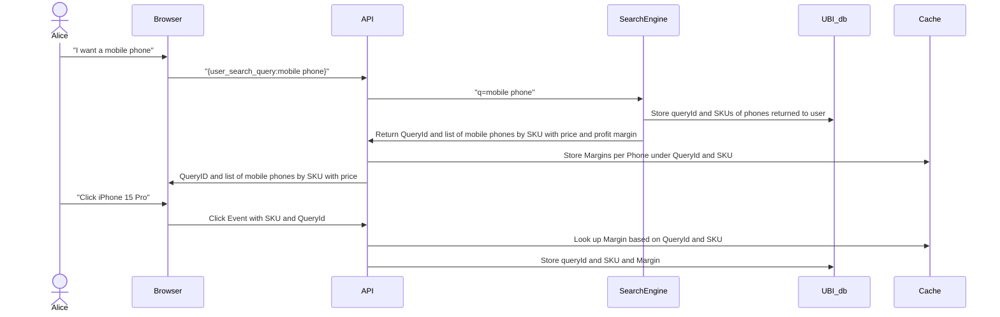

<div align="center">

# User Behavior Insights

UBI (or User Behavior Insights) is a(nother) naive attempt to create **a standard open source format to define and share user event tracking information**. The format is defined as a JSON Schema to validate queries and events defined as JSON objects.
 
 <a href='https://github.com/o19s/ubi/releases'>
  
</a>
<br />
<br />
 
[Why use it](#-why-use-it) •
[How to use it](#-how-to-use-it) •
[FAQ](#-frequently-asked-questions) •
[Who uses it](#-who-uses-it) •
[Who we are](#-who-we-are) •
[How to contribute](#%EF%B8%8F-how-to-contribute) •
[License](#%EF%B8%8F-license) •
[Spread the word!](#-spread-the-word)  
<br />
<br />
  
</div>  

## 🥘 Why use it

Many Search teams struggle with understanding "Why is my user doing this". They have great understanding of an incoming query and the documents returned, but no ability to connect that dot with an indicator of success, such as a click through event or add to cart event.

There are A LOT of tools out there for tracking events, Google Analytics, Snowplow, etc, but each is a bit different, and each tends to lock you in. None of them think about the needs of Search teams specifically either.

The User Behavior Insights standard attempts to provide a search focused standard that can operate across many platforms. There are implementations for
 * [OpenSearch](https://github.com/o19s/documentation-website/tree/ubi-docs-consolidation/_search-plugins/ubi)
 * [Apache Solr](https://github.com/apache/solr/pull/2452)


## 🪛 How to use it

 
UBI requires coordination between the client (a browser, a mobile app, etc) and the backend, which is documented using JSON Schema.

| JSON Schema | HTML Docs |
| --- | --- |
 [query.request.schema.json](https://o19s.github.io/ubi/schema/1.1.0/query.request.schema.json) | [query.request.schema.html](https://o19s.github.io/ubi/docs/html/1.1.0/query.request.schema.html) |
| [query.response.schema.json](https://o19s.github.io/ubi/schema/1.1.0/query.response.schema.json) | [query.response.schema.html](https://o19s.github.io/ubi/docs/html/1.1.0/query.response.schema.html) |
| [event.schema.json](https://o19s.github.io/ubi/schema/1.1.0/event.schema.json) | [event.schema.html](https://o19s.github.io/ubi/docs/html/1.1.0/event.schema.html) |

You just need to copy, download or reference one of the schema files to validate a UBI data structure, built as a JSON file from scratch, or a JSON generated previously (for example, [these samples](https://github.com/o19s/ubi/blob/master/samples/)).

To get started, you can copy both schema and sample in an **online validator** like [jsonschemavalidator.net](https://www.jsonschemavalidator.net/) or [liquid-technologies.com/online-json-schema-validator](https://www.liquid-technologies.com/online-json-schema-validator). Make sure to just copy the UBI related portions, and not any of the search engine specific code. Here is the UBI portion from the file [query-solr.json](https://github.com/o19s/ubi/blob/master/samples/query-solr.json) for example:

```json
{
  "ubi": "true",
  "query_id": "xyz890",
  "user_query": {
    "query": "RAM memory",
    "experiment": "supersecret",
    "page": 1,
    "filter": "productStatus:available"
  }            
}
```

You also have implementations to validate a JSON file programmatically in almost every [coding language](https://json-schema.org/implementations.html).

> :warning: **The current UBI Schema has been designed using the 2020-12 Specification Draft**: When choosing a validator, please, check if it's compliant with the 2020-12 Draft. You can get much more information about the JSON Schema Specification in [json-schema.org](https://json-schema.org/).


---

The Schema is documented by itself, but it's much easier to get "the big picture" with a graphical representation:

<div align="center">
  
 </div>
<br />


## 🤔 Frequently Asked Questions

#### How do I handle anonymous users?
We often want to track a specific identifer for a user, but then realize that we also want to connect those events to previously unauthenticated events. Therefore, we can't just plop in a explicit user id as the `client_id` attribute. Instead, you want to track something that is permanent, across the anonymous AND logged in session as the `client_id`. To make processing simpler you can store the explicit user identifier in the [Event --> Event Attributes --> Additional Properties](https://o19s.github.io/ubi/docs/html/event.schema.html#event_attributes_additionalProperties) hash. Here is an example of user "abc" who clicked on item with sku "1234":

```json
{
  "action_name": "item_click",
  "query_id": "00112233-4455-6677-8899-aabbccddeeff",
  "message_type": "INFO",
  "message": "User abc clicked sku 1234",
  "event_attributes": {
    "position":{},
    "object": {
      "object_id":"1234"
      "object_id_field": "sku",
      "user_id":"abc"
    }
  }
}
```

In post processing, you can use the Client ID field to connect queries and events from the anonymous user to queries and events after they are logged in, and pluck the explicit user id from the detailed event_attributes information.

#### Where do I record my user id and item id?

If your user identification is stable, then feel free to use the [Query Request --> Client ID](https://o19s.github.io/ubi/docs/html/query.request.schema.html#client_id) and [Event --> Client ID](https://o19s.github.io/ubi/docs/html/event.schema.html#client_id).  Otherwise, see the above FAQ entry for how to handle it.  The item ID is tracked for an event in the [Event --> Object](https://o19s.github.io/ubi/docs/html/event.schema.html#event_attributes_object) datastructure.

#### How can I correlate private sensitive data with public event tracking?

We often have sensitive data that is returned as part of the search process that changes quickly, and we would not want to expose that information in front end, even hidden!

For example, in ecommerce, we might want to track the margin that is earned on a product, but not pass that data back to the browser, just to collect it later in the events.

To do that, we introduce a cache into our architecture for this sensitive data:



Another common reason is to have rich events, but reduce the volume of data passed over the wire to the client.

We sometimes refer to this shortcut architecture as "the Panama Canal", as in taking an extreme shortcut!
 


### 🏫 Learn More

* OpenSearchCon EU - [User Behavior Insights](https://www.youtube.com/watch?v=dH7SPHKpxo0&list=PLzgr9zSpws14zCETcKtCBwcOuTGMccpV9&index=32)
* Haystack Conf 2024 - [Your Search Engine Needs a Memory](https://www.youtube.com/watch?v=QltMXXHcwTI)

## 🎨 Who uses it

We are trialing UBI as an interchangeable format **to simplify understanding of what users are doing** and are looking for more collaborators.


## 🤓 Who we are

As common in new projects, the individual or group who started the project also administers the project, establishes its vision, and controls permissions to merge code into it. **We are thinking about how to establish a more robust governance structure**.

## ⚙️ How to contribute

UBI is an open-source project. We are committed to a fully transparent development process and appreciate highly any contributions. Whether you are helping us fix bugs, proposing new features, improving our documentation or spreading the word - we would love to have you as part of the UBI community.

Please refer to our [Contribution Guidelines](https://github.com/o19s/ubi/blob/master/CONTRIBUTING.md) and [Code of Conduct](https://github.com/o19s/ubi/blob/master/code_of_conduct.md).

## ⚖️ License

UBI is available under the Apache Software License, version 2.

## 🌟 Spread the word!

If you want to say thank you and/or support active development of UBI:

- Add a GitHub Star to the project!
- Contact Eric at epugh@opensourceconnections.com or Stavros at macrakis@gmail.com

Thanks so much for your interest in growing the reach of UBI!

_This site was inspired by https://github.com/getmanfred/mac. Thank you!_
